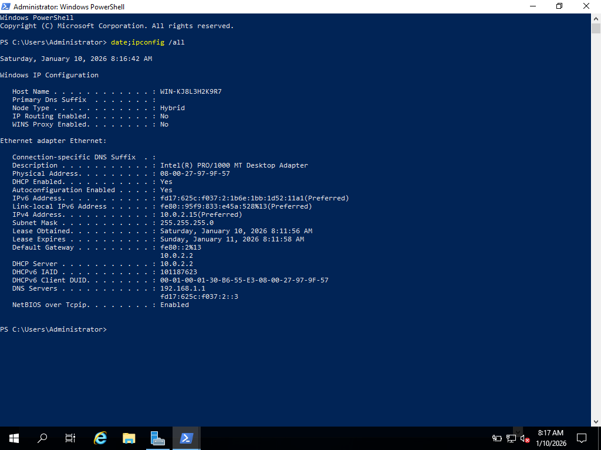
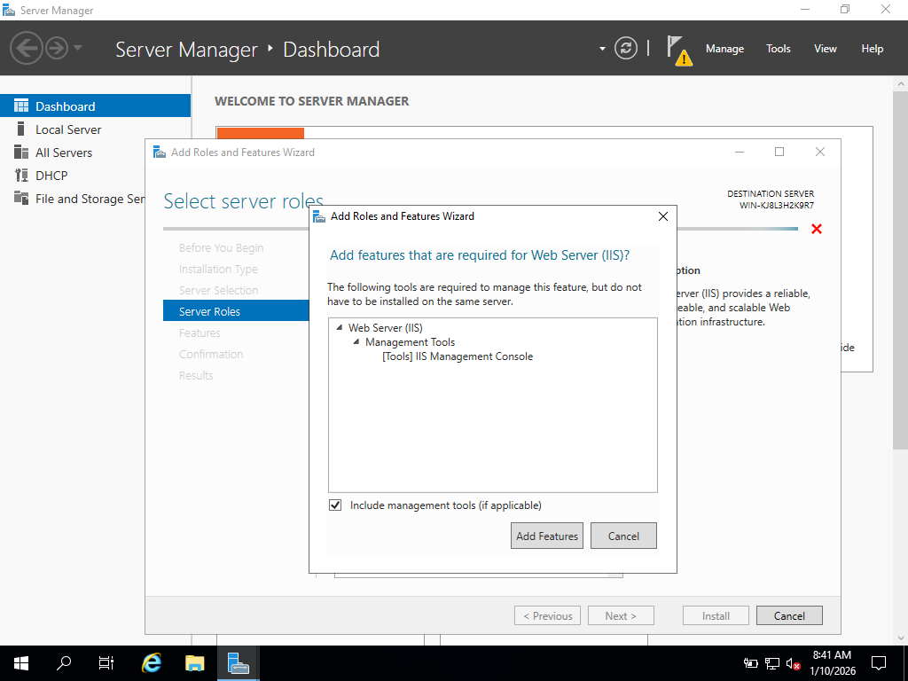

# 🖥️ Windows Server 2016 — Network Services Lab

> **Lab 6 · NIT2122 Lab Assessment 2** | Managing Windows Server Network Services  
> Hands-on configuration of **DHCP** and **IIS** roles on Windows Server 2016 via Microsoft Azure VM

---

<div align="center">


</div>

---

## 📋 Table of Contents

- [Overview](#-overview)
- [Lab Objectives](#-lab-objectives)
- [Prerequisites](#-prerequisites)
- [Activity 7-1 · Installing and Configuring DHCP](#-activity-7-1--installing-and-configuring-dhcp)
  - [Step 1.0 — Server Info Verification](#step-10--server-info-verification)
  - [Step 1.10 — DHCP Server Role Info](#step-110--dhcp-server-role-info)
  - [Step 1.14 — DHCP Tree View (IPv4 & IPv6)](#step-114--dhcp-tree-view-ipv4--ipv6)
  - [Step 1.17 — Scope Configuration](#step-117--scope-configuration)
  - [Step 1.18 — IP Address Range Setup](#step-118--ip-address-range-setup)
  - [Step 1.35 — DNS Dynamic Update Settings](#step-135--dns-dynamic-update-settings)
  - [DHCP Q&A](#dhcp-qa)
- [Activity 7-2 · Installing and Configuring IIS](#-activity-7-2--installing-and-configuring-iis)
  - [Step 2.0 — Server Info Verification](#step-20--server-info-verification)
  - [Step 2.6 — Web Server (IIS) Role Selection](#step-26--web-server-iis-role-selection)
  - [Step 2.12 — IIS Client Certificate Mapping Auth](#step-212--iis-client-certificate-mapping-authentication)
  - [Step 2.18 — Virtual Directory Creation](#step-218--virtual-directory-creation)
  - [Step 2.27 — Default Document Configuration](#step-227--default-document-configuration)
  - [Step 2.33 — IIS User Security Permissions](#step-233--iis-user-security-permissions)
  - [Step 2.38 — Connection Limits Configuration](#step-238--connection-limits-configuration)
  - [IIS Q&A](#iis-qa)
- [Key Takeaways](#-key-takeaways)

---

## 🌐 Overview

This lab guides you through the installation and configuration of two critical **Windows Server 2016** network services using **Server Manager** on a **Microsoft Azure Virtual Machine**:

| Service | Role | Purpose |
|---------|------|---------|
| **DHCP** | Dynamic Host Configuration Protocol | Automatically assigns IP addresses and network config to clients |
| **IIS** | Internet Information Services | Hosts web applications and static websites on Windows Server |

Both roles are installed via the **Add Roles and Features Wizard** in Server Manager, then configured with scopes, security settings, and virtual directories.

---

## 🎯 Lab Objectives

- ✅ Install the **DHCP Server** role using Server Manager
- ✅ Create and configure a **DHCP Scope** with an IP address range and exclusions
- ✅ Enable and configure **DNS Dynamic Updates** from the DHCP server
- ✅ Install the **Web Server (IIS)** role with security modules
- ✅ Create a **Virtual Directory** under the Default Web Site
- ✅ Configure **connection limits** and **directory browsing** in IIS
- ✅ Review and apply **user security permissions** for web clients

---

## ⚙️ Prerequisites

Before starting this lab, ensure the following are in place:

- Windows Server 2016 running on an **Azure VM**
- Administrator credentials with **domain admin rights**
- A valid **DNS server address** (from Activity 3-1, or the local machine IP)
- Known **subnet mask** and **DHCP authorization** details
- Active **Server Manager** session

---

## 🔵 Activity 7-1 · Installing and Configuring DHCP

**Objective:** Install the DHCP Server role and configure a DHCP scope for automatic IP address assignment.

**Description:** DHCP is installed as a server role in Windows Server 2016 using Server Manager. You install DHCP, configure an address scope, set exclusions, configure lease duration, and verify DNS dynamic update settings.

> 📸 **Screenshots required:** Steps `1.0`, `1.10`, `1.14`, `1.17`, `1.18`, `1.35`  
> 💬 **Questions answered:** Steps `1.19`, `1.21`, `1.25`, `1.28`

---

### Step 1.0 — Server Info Verification

Open a **Command Prompt** or **PowerShell** window and run the following to confirm the server identity and date/time on the Azure VM:

```powershell
date; ipconfig /all
```

This captures the current system date alongside all network adapter configurations — confirming the correct Azure VM and IP environment before beginning role installation.


> 📌 *The output shows the VM's hostname, IPv4 address, subnet mask, default gateway, and DNS servers. Always verify this before making server role changes.*

---

### Step 1.10 — DHCP Server Role Info

After clicking through the **Add Roles and Features Wizard**:
- Select **DHCP Server** in the *Select server roles* window
- Add Features (IIS management tool) when prompted
- In the **DHCP Server** info window — review all listed notes before proceeding


> 📌 *The DHCP Server information window highlights post-installation configuration steps, including the requirement to authorize the server in Active Directory Domain Services.*

---

### Step 1.14 — DHCP Tree View (IPv4 & IPv6)

After installation completes:
1. Click **Tools → DHCP** to open the DHCP Management Console
2. In the left pane, **double-click the server name** to expand it
3. Confirm that both **IPv4** and **IPv6** nodes are visible under the server


> 📌 *Both IPv4 and IPv6 protocol nodes appear under your server — this confirms the DHCP role installed successfully and is ready for scope configuration.*

---

### Step 1.17 — Scope Configuration

Right-click **IPv4 → New Scope** and launch the **New Scope Wizard**:

- **Scope Name:** `AdminYourLastName` (e.g., `AdminSmith`)
- **Description:** `Admin area subnet`

This name uniquely identifies the scope in a multi-scope environment, making it easy to manage and audit later.


> 📌 *Using a consistent, descriptive naming convention is critical in enterprise environments where multiple scopes may exist across VLANs or departments.*

---

### Step 1.18 — IP Address Range Setup

Configure the address pool for the new scope:

| Setting | Value |
|--------|-------|
| Start IP Address | `198.4.100.51` |
| End IP Address | `198.4.100.99` |
| Subnet Mask | `255.255.255.0` |

> 💡 *Use the period key (`.`) to move between octets in the IP address fields.*


> 📌 *This defines the pool of leasable IP addresses. The subnet mask `/24` supports up to 254 hosts — scoped here to 49 addresses for administrative control.*

---

### Step 1.35 — DNS Dynamic Update Settings

Navigate to **IPv4 → Properties → DNS Tab** and verify the following settings:

- ✅ **Enable DNS dynamic updates according to the settings below** — Checked
- ✅ **Dynamically update DNS records only if requested by the DHCP clients** — Selected
- ✅ **Discard A and PTR records when lease is deleted** — Checked


> 📌 *This ensures DHCP-registered clients are automatically updated in DNS when leases are issued or expired — keeping name resolution accurate without manual intervention. Enabling "Discard A and PTR records when lease is deleted" prevents stale DNS records from accumulating.*

---

### DHCP Q&A

<details>
<summary><strong>Step 1.19 — What happens after clicking Add in the exclusion window? Is an ending address required?</strong></summary>

> The specified IP address is **immediately added to the exclusion list** shown below the input fields. An **ending address is not required** — if only a start address is entered, only that single IP is excluded. To exclude a range, both start and end addresses must be provided.

</details>

<details>
<summary><strong>Step 1.21 — What is the default lease time and when is it appropriate?</strong></summary>

> The default lease duration is **8 Days, 0 Hours, 0 Minutes**.  
> This default is appropriate for **stable, wired office environments** where devices (desktops, servers, printers) remain connected consistently. It reduces DHCP renewal traffic without risking address exhaustion. Shorter leases (e.g., 1–2 hours) are better suited for environments with high device turnover, such as conference rooms or public Wi-Fi hotspots.

</details>

<details>
<summary><strong>Step 1.25 — How do you enter more than one DNS server?</strong></summary>

> Enter the IP address of the first DNS server in the **IP address field** and click **Add**. Then type the second DNS server's IP in the same field and click **Add** again. Each DNS server is appended to the list in priority order — the server at the top is queried first.

</details>

<details>
<summary><strong>Step 1.28 — What appears in the DHCP middle pane after clicking Finish?</strong></summary>

> The **IP address range** of the newly created scope appears in the middle pane. Selecting **Address Pool** in the left pane (under the scope) reveals the full breakdown: **available addresses**, **leased addresses**, and **excluded addresses** — giving a real-time view of pool utilization.

</details>

---

## 🟢 Activity 7-2 · Installing and Configuring IIS

**Objective:** Install the Web Server (IIS) role and configure virtual directories, security, and connection limits.

**Description:** The **Web Server (IIS)** role transforms Windows Server 2016 into a full-featured website hosting platform. Using Server Manager, you install IIS with selected security modules, configure a virtual directory, and apply connection and security settings.

> 📸 **Screenshots required:** Steps `2.0`, `2.6`, `2.12`, `2.18`, `2.27`, `2.33`, `2.38`  
> 💬 **Questions answered:** Steps `2.11`, `2.21`, `2.25`

---

### Step 2.0 — Server Info Verification

Open a **Command Prompt** or **PowerShell** window and run:

```powershell
date; ipconfig /all
```

Capture the current Azure VM session details, including the date/time from the taskbar, confirming the correct environment prior to IIS installation.


> 📌 *This baseline capture documents the server state before IIS role installation — important for lab reproducibility and audit trails.*

---

### Step 2.6 — Web Server (IIS) Role Selection

In the **Add Roles and Features Wizard → Select server roles**:

1. Check the box for **Web Server (IIS)**
2. When the wizard prompts, click **Add Features** to include the **IIS Management Console**
3. Proceed through the features and role services windows


> 📌 *Selecting "Add Features" installs the IIS graphical management console (IIS Manager), which is essential for post-installation configuration of sites, virtual directories, bindings, and security.*

---

### Step 2.12 — IIS Client Certificate Mapping Authentication

In the **Select role services** window, navigate to **Security** and enable:

- ☑️ **IIS Client Certificate Mapping Authentication**

This module maps client digital certificates directly to Windows user accounts, enabling **certificate-based authentication** without Active Directory dependency.


> 📌 *Client certificate mapping adds a strong, passwordless authentication layer — ideal for enterprise applications requiring mutual TLS (mTLS) between client and server.*

---

### Step 2.18 — Virtual Directory Creation

After installing IIS, open **IIS Manager → Default Web Site → Add Virtual Directory**:

| Field | Value |
|-------|-------|
| Alias | `wwwFirstName` (e.g., `wwwJohn`) |
| Physical Path | `C:\Users\Student\wwwYourFirstName` |

> 💡 *Click the browse button (`...`) and use **Make New Folder** to create the physical directory if it doesn't already exist.*


> 📌 *Virtual directories allow IIS to serve content from any physical path on the server — or even a UNC network share — under a clean URL alias, without exposing the underlying folder structure to clients.*

---

### Step 2.27 — Default Document Configuration

Double-click **Default Document** in the IIS Manager middle pane to view the list of files IIS will serve when a client connects without specifying a filename:

- `Default.htm`
- `Default.asp`
- `index.htm`
- `index.html`
- `iisstart.htm`

Right-click any entry to **move it up or down** in priority — the topmost file that exists in the directory will be served first.


> 📌 *Correctly configuring default documents prevents IIS from returning `403 Forbidden` errors when clients browse to the root of your site. Place your primary landing page at the top of this list.*

---

### Step 2.33 — IIS User Security Permissions

Navigate to **Default Web Site → Edit Permissions → Security Tab** and select:

**`Users (s1234567\IIS_IUSERS)`** from the *Group or user names* list to review the permissions granted to anonymous web visitors in the domain.


> 📌 *The `IIS_IUSERS` group controls what anonymous web clients can access on the server's file system. Limiting this group's permissions to **Read & Execute** on web root directories is a security best practice — preventing unauthorized file writes or directory traversal.*

---

### Step 2.38 — Connection Limits Configuration

In IIS Manager, select **Default Web Site → Configure → Limits**:

| Setting | Value |
|---------|-------|
| Connection time-out (seconds) | `240` |
| Limit number of connections | ✅ Enabled |
| Maximum simultaneous connections | `500` |

Click **OK** to apply.


> 📌 *Connection limits are a first line of defense against DoS conditions. Setting a 240-second timeout reclaims resources from idle sessions. The 500-connection ceiling should be baselined against real-world traffic and adjusted incrementally (e.g., ±50) as load patterns are observed.*

<br>

**Additional IIS Configuration Reference:**

The following captures document supplementary verification steps — directory browsing enablement and the overall IIS Manager state after all configurations are applied:





---

### IIS Q&A

<details>
<summary><strong>Step 2.11 — What modules are checked by default in the Select role services window?</strong></summary>

The following IIS role services are selected by default:

**Common HTTP Features**
- Static Content
- Default Document
- Directory Browsing
- HTTP Errors

**Health and Diagnostics**
- HTTP Logging

**Performance**
- Static Content Compression

**Security**
- Request Filtering

**Management Tools**
- IIS Management Console

</details>

<details>
<summary><strong>Step 2.21 — How can you set up the virtual directory folder for sharing?</strong></summary>

> Navigate to the folder's **Properties → Sharing Tab**, click **Advanced Sharing**, check **Share this folder**, and then configure **Permissions** for the appropriate users or groups. This exposes the folder as a network share while keeping it accessible via IIS as a virtual directory.

</details>

<details>
<summary><strong>Step 2.25 — How can you rename the website? How can you restart a stopped website?</strong></summary>

> **Renaming:** Right-click **Default Web Site** in the IIS Manager tree → select **Rename** → type the new name and press Enter.  
>
> **Restarting a stopped site:** Right-click the website → hover over **Manage Website** → click **Start** (if stopped) or **Restart** (if running but needing a refresh). This can also be done from the **Actions** panel on the right side of IIS Manager.

</details>

---

## 💡 Key Takeaways

| Concept | Detail |
|---------|--------|
| **DHCP Role** | Installed via Server Manager; requires Active Directory authorization before leasing addresses |
| **DHCP Scope** | Defines the leasable IP range, exclusions, lease duration, and default gateway/DNS options |
| **DNS Dynamic Updates** | DHCP can automatically register/deregister client A and PTR records in DNS |
| **IIS Role** | Installed with granular role services; modules like Client Certificate Auth must be explicitly selected |
| **Virtual Directories** | Map URL aliases to physical paths, enabling clean URL structures without moving files |
| **IIS Security** | `IIS_IUSERS` group controls anonymous access; Client Certificate Mapping adds strong auth |
| **Connection Limits** | Protects server resources; timeout + connection cap prevents DoS and resource exhaustion |

---

<div align="center">

**NIT2122 · Lab Assessment 2 · Lab 6**  
Windows Server 2016 Network Services Configuration  

*Completed on Microsoft Azure Virtual Machine*

</div>
