Got you — I’ll **fix your screenshot section (with working names)** + add a **clean skills section** so you can paste directly 👇

---

# 📸 Lab Walkthrough

---

## 🔹 DHCP Configuration

### 📌 System Information Check


Displays system date and full network configuration using:

```
date; ipconfig /all
```

---

### 📌 DHCP Role Installation

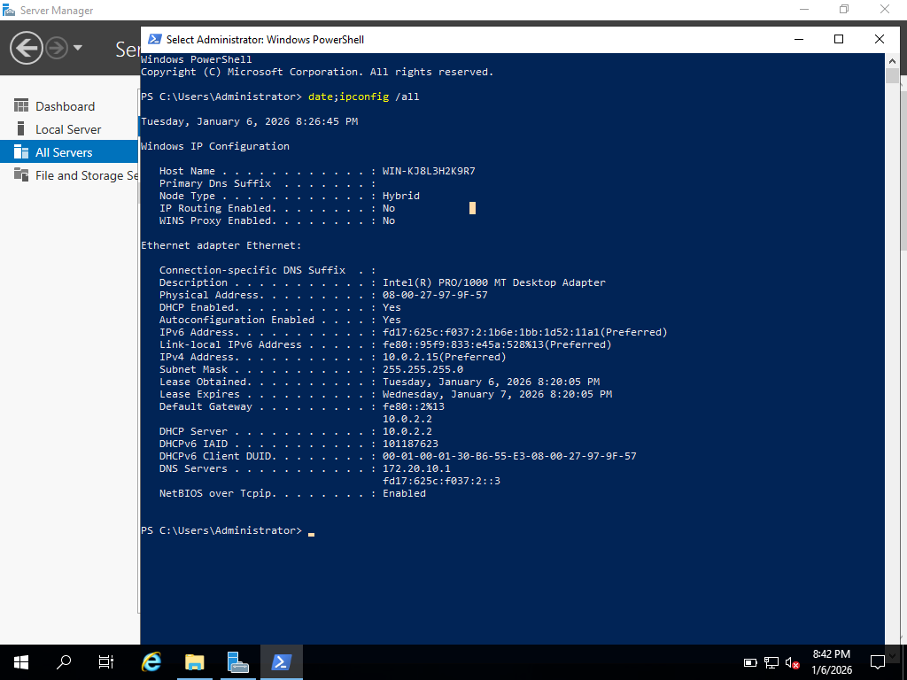
Initial setup of the DHCP Server role through Server Manager.

---

### 📌 DHCP Server Console

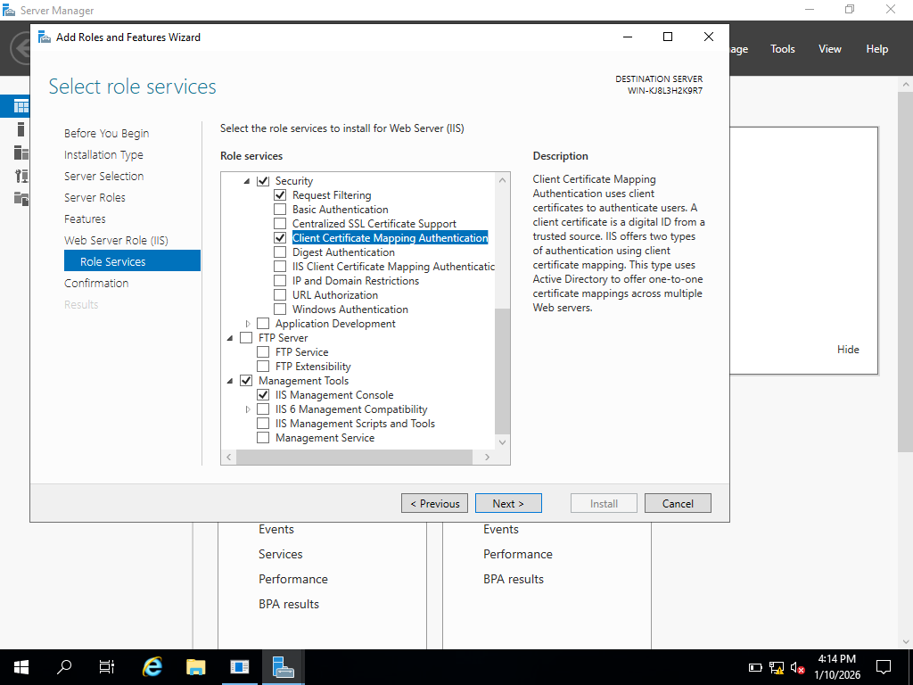
Verification of DHCP installation with IPv4 and IPv6 visibility.

---

### 📌 Scope Configuration

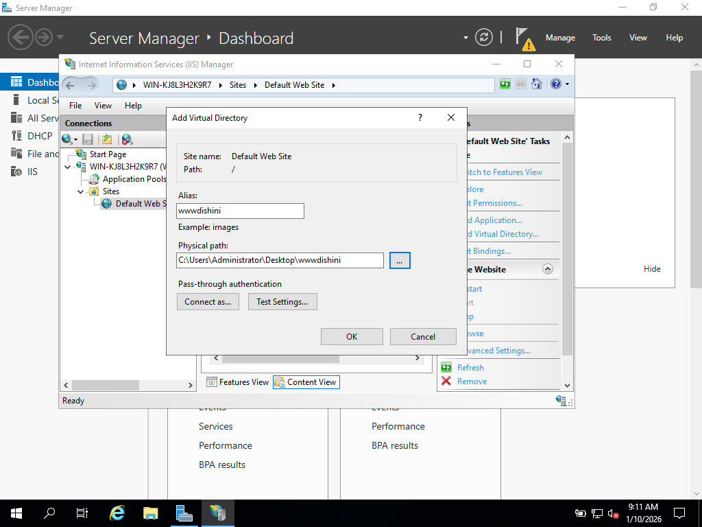
Creation of a DHCP scope to define IP address distribution.

---

### 📌 IP Address Range

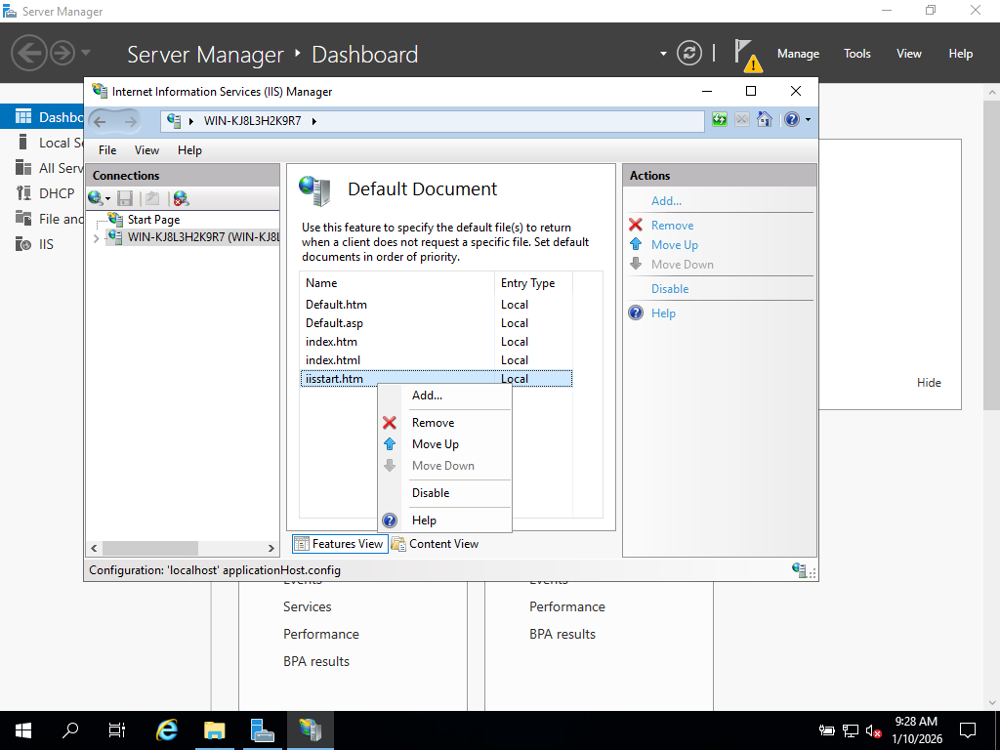
Configuration of IP range and subnet mask for client allocation.

---

### 📌 DNS Dynamic Updates

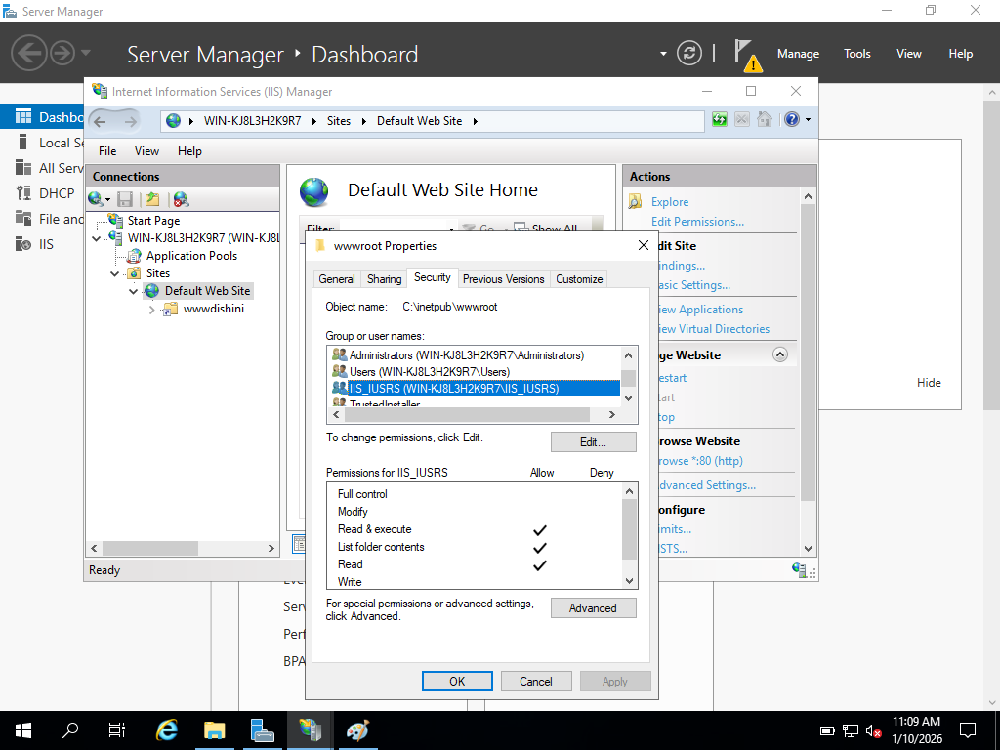
Ensures automatic DNS record updates for DHCP clients.

---

## 🔹 IIS Configuration

### 📌 System Check Before IIS

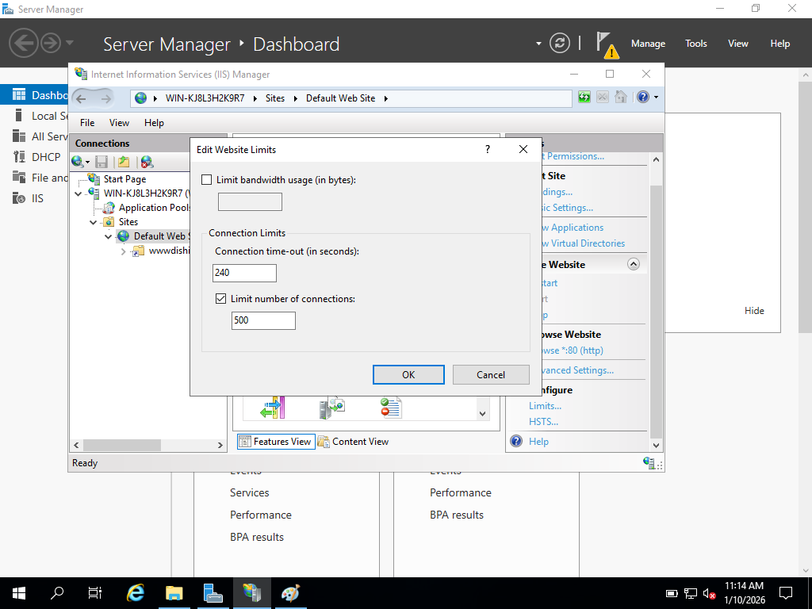
Validation of system configuration before IIS installation.

---

### 📌 IIS Role Selection

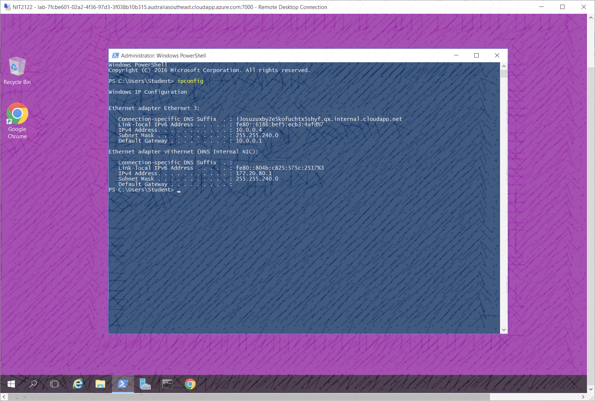
Selection of Web Server (IIS) role and required features.

---

### 📌 Security Feature Configuration

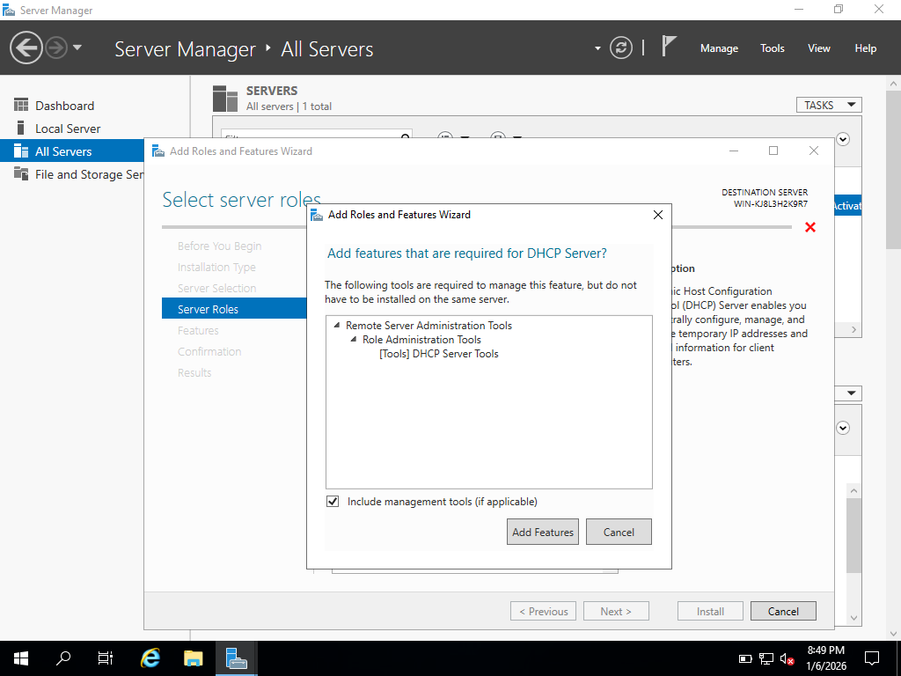
Enabling IIS Client Certificate Mapping Authentication.

---

### 📌 Virtual Directory Setup

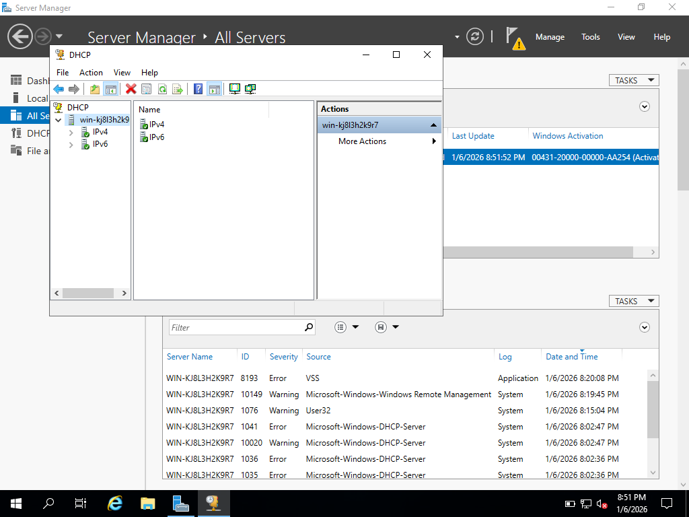
Creation of a virtual directory for hosting web content.

---

### 📌 Default Document Settings

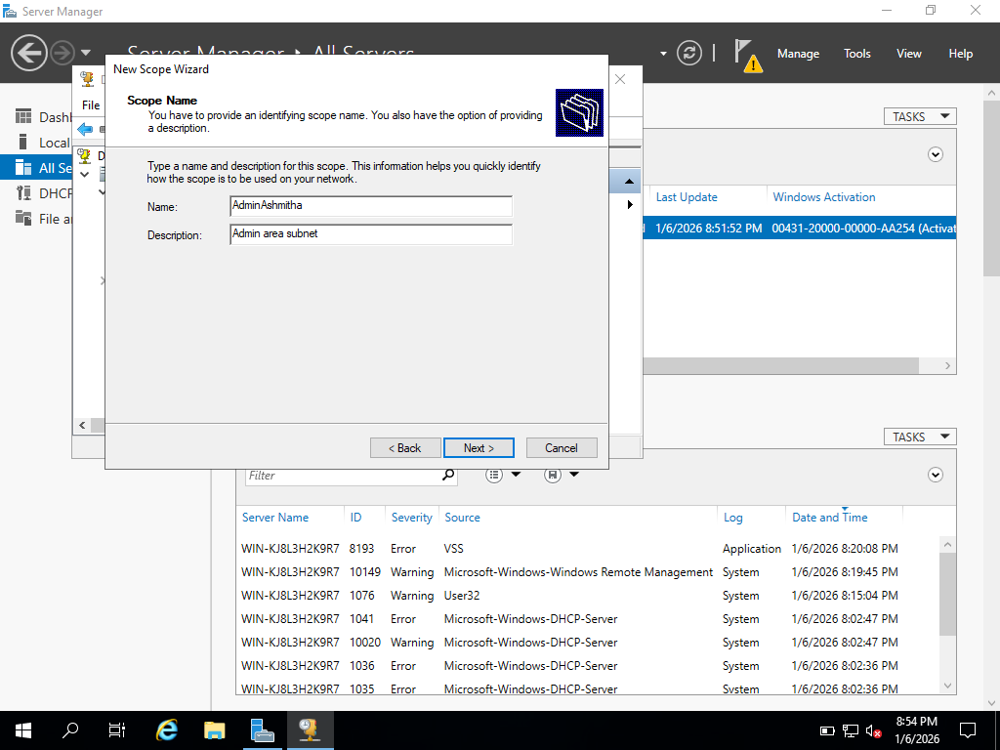
Configuration of default web pages for client requests.

---

### 📌 User Permissions

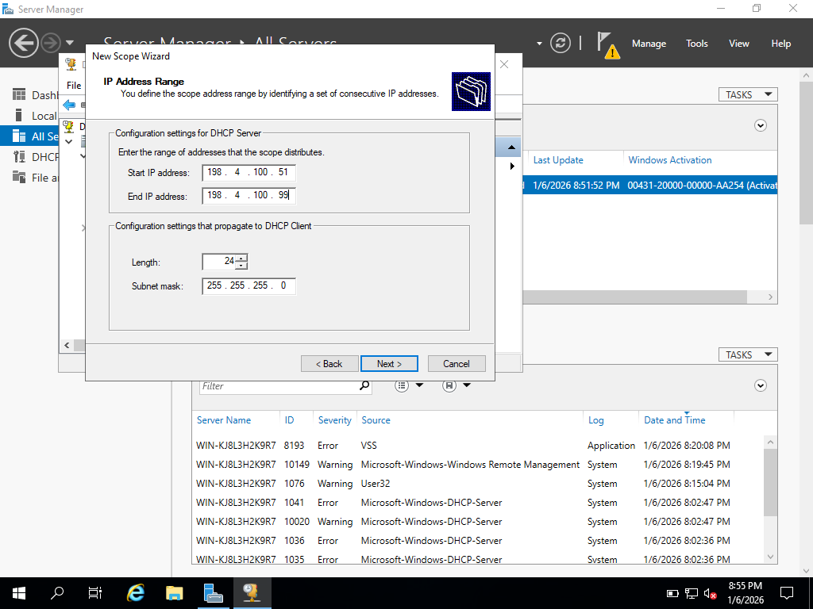
Review of IIS user access and security permissions.

---

### 📌 Connection Limits Configuration

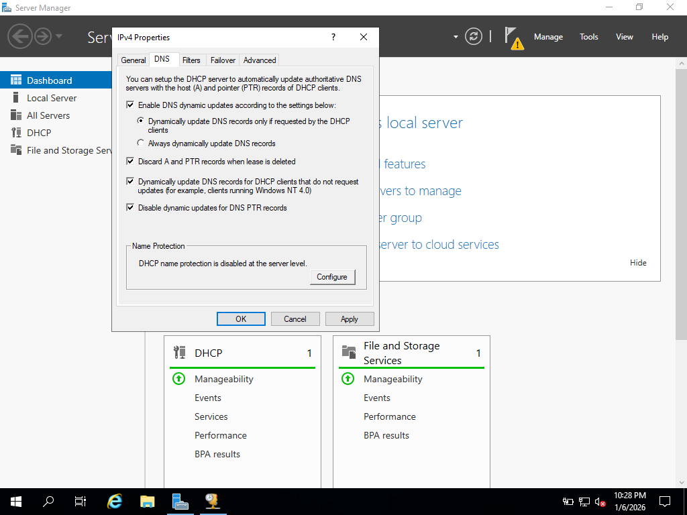
Setting maximum connections and timeout limits to control server load.

---

# 🧩 Skills Demonstrated

* Windows Server administration (DHCP & IIS)
* Network configuration (IP addressing, DNS integration)
* Web server setup and management
* Security awareness (DHCP & IIS attack risks)
* Troubleshooting and system analysis
* Technical documentation and GitHub project presentation


